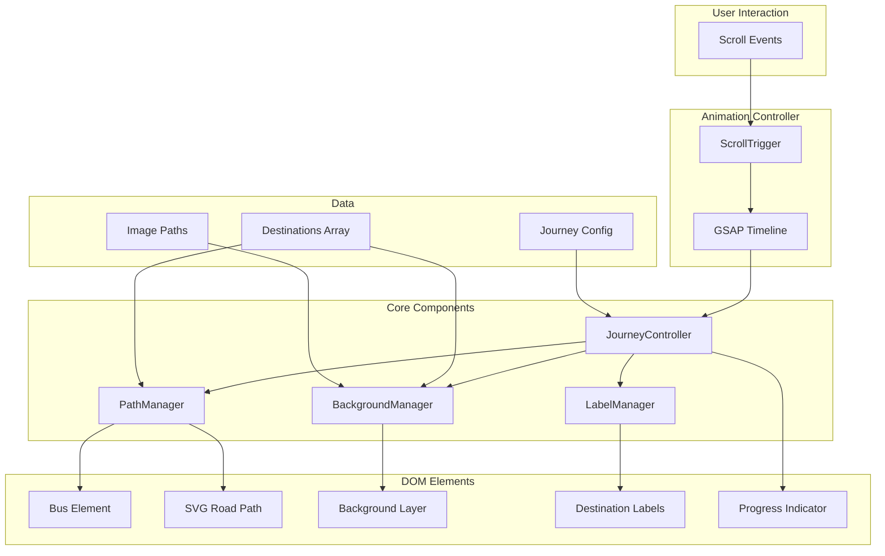

# Design Document: Scroll Journey Animation

## Overview

This feature creates an immersive scroll-driven journey animation for the Himalayan Escapes tour details page. The animation transforms the static itinerary into an interactive visual experience where users scroll to "drive" a bus along a winding mountain road, with background images transitioning to show each destination along the Chandigarh to Manali route.

The implementation uses GSAP (GreenSock Animation Platform) with ScrollTrigger for smooth, performant scroll-based animations. The system calculates bus position along an SVG path, manages background image transitions, and provides visual feedback through destination labels and progress indicators.

## Architecture



## Components and Interfaces

### 1. JourneyController

The main orchestrator that initializes and coordinates all animation components.

```javascript
interface JourneyController {
  // Initialize the journey animation system
  init(): void;
  
  // Update all components based on scroll progress (0-1)
  update(progress: number): void;
  
  // Get current destination based on progress
  getCurrentDestination(progress: number): Destination;
  
  // Cleanup and destroy animation
  destroy(): void;
}
```

### 2. PathManager

Manages the SVG road path and bus positioning.

```javascript
interface PathManager {
  // Get point coordinates at a given progress (0-1)
  getPointAtProgress(progress: number): { x: number, y: number };
  
  // Get rotation angle at a given progress (tangent to path)
  getRotationAtProgress(progress: number): number;
  
  // Update road stroke based on progress
  updateRoadStroke(progress: number): void;
  
  // Move bus to position
  moveBus(progress: number): void;
}
```

### 3. BackgroundManager

Handles background image transitions.

```javascript
interface BackgroundManager {
  // Preload all destination images
  preloadImages(): Promise<void>;
  
  // Transition to destination image
  transitionTo(destination: Destination): void;
  
  // Get current active background
  getCurrentBackground(): string;
}
```

### 4. LabelManager

Controls destination label display.

```javascript
interface LabelManager {
  // Show label for destination
  showLabel(destination: Destination): void;
  
  // Hide current label
  hideLabel(): void;
  
  // Format label text (e.g., "Day 1 - Bilaspur Lake")
  formatLabel(destination: Destination): string;
}
```

## Data Models

### Destination

```javascript
interface Destination {
  id: string;              // Unique identifier (e.g., "bilaspur-lake")
  name: string;            // Display name (e.g., "Bilaspur Lake")
  day: number;             // Day of tour (1-4)
  progress: number;        // Position on path (0-1)
  imagePath: string;       // Path to background image
  coordinates: {           // Position on SVG path
    x: number;
    y: number;
  };
}
```

### JourneyConfig

```javascript
interface JourneyConfig {
  destinations: Destination[];
  pathSelector: string;           // SVG path element selector
  busSelector: string;            // Bus element selector
  backgroundSelector: string;     // Background container selector
  transitionDuration: number;     // Background fade duration (ms)
  scrollTriggerConfig: {
    trigger: string;              // Section to track
    start: string;                // ScrollTrigger start position
    end: string;                  // ScrollTrigger end position
    scrub: number | boolean;      // Smooth scrubbing
  };
}
```

### Default Journey Configuration

```javascript
const defaultJourneyConfig: JourneyConfig = {
  destinations: [
    // DAY 1: Chandigarh to Manali
    { id: 'chandigarh', name: 'Chandigarh', day: 1, progress: 0, imagePath: null },
    { id: 'bilaspur-lake', name: 'Bilaspur Lake', day: 1, progress: 0.04, imagePath: '../himachal/BILASPUR LAKE.jpeg' },
    { id: 'sundernagar-dam', name: 'Sundernagar Dam', day: 1, progress: 0.08, imagePath: '../himachal/SUNDERNAGAR DAM.jpg' },
    { id: 'pandoh-dam', name: 'Pandoh Dam', day: 1, progress: 0.12, imagePath: '../himachal/Pandoh Dam.jpeg' },
    { id: 'vaishno-devi', name: 'Vaishno Devi Temple', day: 1, progress: 0.16, imagePath: '../himachal/Vaishno Devi Temple.jpg' },
    { id: 'rafting', name: 'River Rafting', day: 1, progress: 0.20, imagePath: '../himachal/Rafting.jpeg' },
    { id: 'paragliding', name: 'Paragliding', day: 1, progress: 0.24, imagePath: '../himachal/Paragliding.jpeg' },
    { id: 'shawls-factory', name: 'Shawls Factory', day: 1, progress: 0.28, imagePath: '../himachal/Shawls Factory.jpeg' },
    
    // DAY 2: Manali to Snow Point
    { id: 'nehru-kund', name: 'Nehru Kund', day: 2, progress: 0.32, imagePath: '../himachal/Nehru Kund.jpeg' },
    { id: 'solang-valley', name: 'Solang Valley', day: 2, progress: 0.38, imagePath: '../himachal/Solang Valley.jpeg' },
    { id: 'atal-tunnel', name: 'Atal Tunnel', day: 2, progress: 0.44, imagePath: '../himachal/Atal Tunnel.jpeg' },
    { id: 'mall-road', name: 'Mall Road', day: 2, progress: 0.50, imagePath: '../himachal/Mall Road.jpeg' },
    
    // DAY 3: Manali Local
    { id: 'jogini-waterfall', name: 'Jogini Waterfall', day: 3, progress: 0.56, imagePath: '../himachal/Jogini Waterfall.jpeg' },
    { id: 'hadimba-temple', name: 'Hadimba Devi Temple', day: 3, progress: 0.62, imagePath: '../himachal/Hadimba Devi Temple.jpeg' },
    { id: 'manu-temple', name: 'Manu Temple', day: 3, progress: 0.68, imagePath: '../himachal/Manu Temple.jpeg' },
    { id: 'old-manali', name: 'Old Manali', day: 3, progress: 0.74, imagePath: '../himachal/Old Manali.jpeg' },
    { id: 'vashisht-temple', name: 'Vashisht Temple', day: 3, progress: 0.80, imagePath: '../himachal/Vashisht Temple.jpeg' },
    { id: 'van-vihar', name: 'Van Vihar', day: 3, progress: 0.86, imagePath: '../himachal/VAN VIHAR.jpeg' },
    
    // DAY 4: Manali to Chandigarh
    { id: 'naggar-castle', name: 'Naggar Castle', day: 4, progress: 0.93, imagePath: '../himachal/NAGGAR CASTLE.jpg' },
    { id: 'chandigarh-end', name: 'Back to Chandigarh', day: 4, progress: 1.0, imagePath: null }
  ],
  pathSelector: '#journeyPath',
  busSelector: '#journeyBus',
  backgroundSelector: '#journeyBackground',
  transitionDuration: 400,
  scrollTriggerConfig: {
    trigger: '#journeySection',
    start: 'top top',
    end: 'bottom bottom',
    scrub: 1
  }
};
```

## Correctness Properties

*A property is a characteristic or behavior that should hold true across all valid executions of a system-essentially, a formal statement about what the system should do. Properties serve as the bridge between human-readable specifications and machine-verifiable correctness guarantees.*

### Property 1: Scroll-to-Position Mapping

*For any* scroll progress value between 0 and 1, the bus position returned by `getPointAtProgress(progress)` SHALL be a valid point on the SVG path, and the position SHALL be monotonically increasing along the path as progress increases.

**Validates: Requirements 1.1**

### Property 2: Bus Rotation Matches Path Tangent

*For any* position on the path, the rotation angle returned by `getRotationAtProgress(progress)` SHALL equal the tangent angle of the path at that point (within a tolerance of ±2 degrees).

**Validates: Requirements 1.2**

### Property 3: Background Selection Consistency

*For any* scroll progress value, the background image displayed SHALL correspond to the most recently passed destination marker. Specifically, if progress P falls between destination D1 (at progress P1) and D2 (at progress P2) where P1 ≤ P < P2, then the background SHALL show D1's image.

**Validates: Requirements 2.1, 2.3**

### Property 4: Label Format Correctness

*For any* destination object, the formatted label returned by `formatLabel(destination)` SHALL contain both the day number and the place name in the format "Day {day} - {name}".

**Validates: Requirements 3.3**

### Property 5: Road Stroke Progress Mapping

*For any* scroll progress value P, the road stroke dashoffset SHALL be calculated such that exactly P proportion of the total path length is visible (drawn).

**Validates: Requirements 4.1**

### Property 6: Destination-to-Image Mapping

*For any* destination in the configuration that has a corresponding image file in the himachal folder, the `imagePath` property SHALL correctly reference that image file.

**Validates: Requirements 6.2**

### Property 7: Destination Day Grouping

*For any* destination in the configuration, the `day` property SHALL correctly reflect the tour itinerary day:
- Day 1: Chandigarh to Manali (Bilaspur Lake, Sundernagar Dam, Pandoh Dam, Vaishno Devi Temple, Rafting, Paragliding, Shawls Factory)
- Day 2: Manali to Snow Point (Nehru Kund, Solang Valley, Atal Tunnel, Mall Road)
- Day 3: Manali Local (Jogini Waterfall, Hadimba Devi, Manu Temple, Old Manali, Vashisht Temple, Van Vihar)
- Day 4: Manali to Chandigarh (Naggar Castle)

**Validates: Requirements 6.3**

## Error Handling

### Image Loading Failures

- If a destination image fails to load, the system SHALL fall back to a default gradient background
- The system SHALL log the error but continue functioning with available images
- Preloading SHALL use `Promise.allSettled()` to handle partial failures gracefully

### SVG Path Errors

- If the SVG path element is not found, the system SHALL log an error and disable the animation
- If path length calculation fails, the system SHALL use a fallback linear interpolation

### Scroll Event Throttling

- The system SHALL throttle scroll updates to prevent performance issues
- GSAP's built-in scrub mechanism handles this automatically

### Mobile/Touch Handling

- The system SHALL detect touch devices and optimize accordingly
- On low-performance devices, the system MAY reduce animation complexity

## Testing Strategy

### Unit Testing

Unit tests will verify individual component logic using Jest:

- `PathManager.getPointAtProgress()` returns valid coordinates
- `PathManager.getRotationAtProgress()` returns correct angles
- `BackgroundManager.getCurrentBackground()` returns correct image for progress
- `LabelManager.formatLabel()` produces correct format
- Destination configuration validation

### Property-Based Testing

Property-based tests will use fast-check to verify correctness properties:

- **Property 1**: Generate random progress values (0-1), verify bus position is on path
- **Property 2**: Generate random progress values, verify rotation matches path tangent
- **Property 3**: Generate random progress values, verify correct background selection
- **Property 4**: Generate random destination objects, verify label format
- **Property 5**: Generate random progress values, verify stroke calculation
- **Property 6**: Verify all destinations with images have correct paths
- **Property 7**: Verify all destinations have correct day assignments

Each property-based test will run a minimum of 100 iterations.

Property tests will be tagged with: `**Feature: scroll-journey-animation, Property {number}: {property_text}**`

### Integration Testing

- Full scroll simulation testing with Puppeteer/Playwright
- Cross-browser compatibility testing
- Mobile device testing for touch interactions
- Performance testing for frame rate verification
